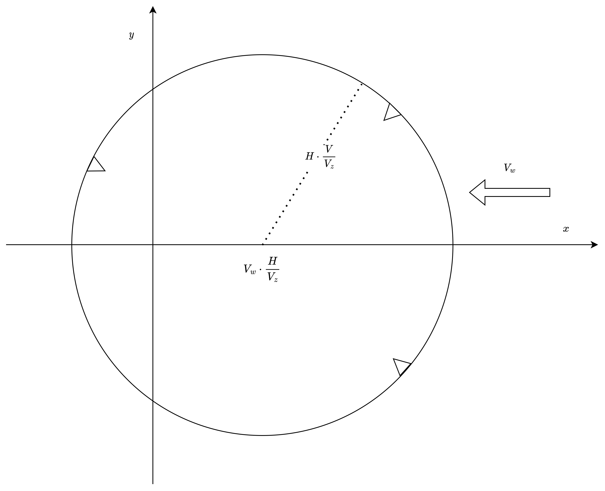
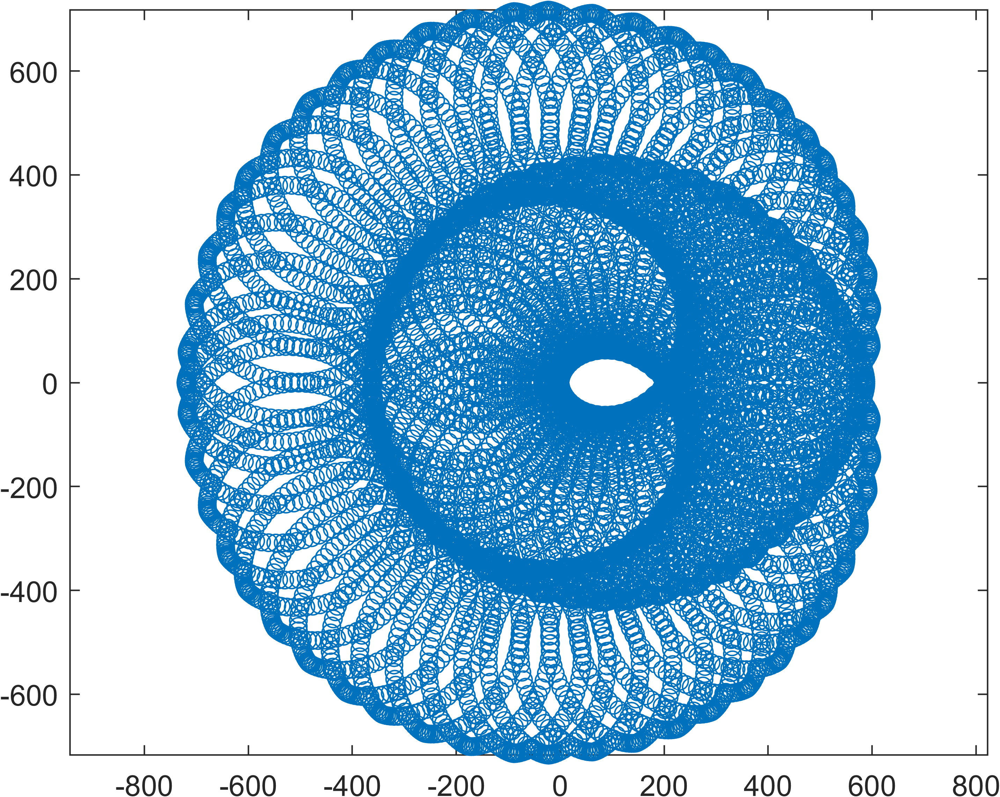
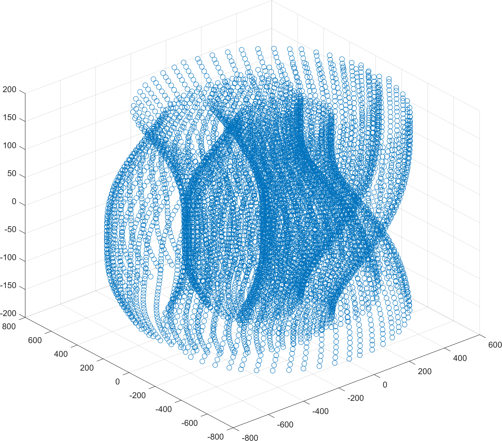
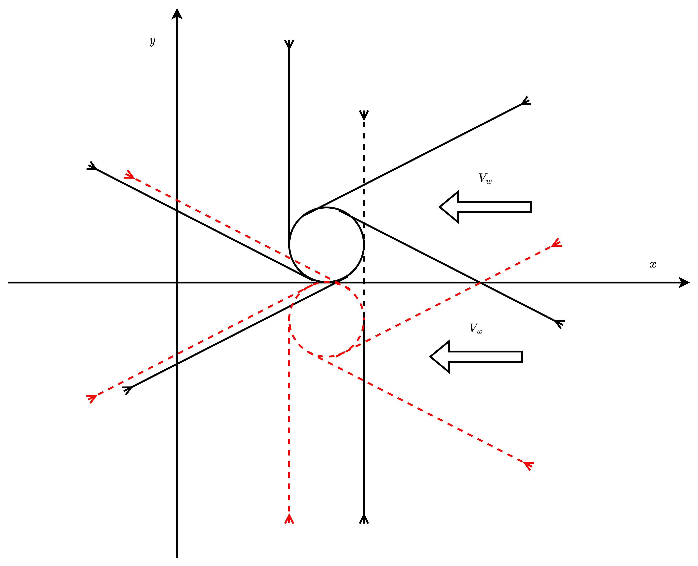

## Parafoil problem

To fly a well designed parafoil requires good understanding of its dynamics. 

We start with the following assumptions:

1. The parafoil is a point mass;
2. Gravity is perfectly balanced by the lift force;
3. The parafoil is steered by changing the heading angle of the parafoil;
4. Wind remains constant at this early stage;
5. x-y plane is the horizontal plane, z is the vertical direction;
6. x is opposite to the direction of the wind, y is perpendicular to the wind direction;
7. Target is at (0,0,0) for (x, y, z) coordinates;
8. The touch down point relative velocity to the ground should be minimized.

## Parafoil dynamics

$$
\left\{
\begin{aligned}
\dot{x} &= V_x = V \cos(\omega) - V_w\\
\dot{y} &= V_y = V \sin(\omega) \\
\dot{\omega} &= u
\end{aligned}\right.
$$

Flight time is determined by initial height and vertical velocity,

$$
T = \frac{H}{V_z}
$$

## Optimal control

The optimal control problem is to minimize the touch down point relative velocity to the ground. The cost function is defined as

$$
\begin{aligned}
& \arg\min_u & \sqrt{V_x(T)^2 + V_y(T)^2} \\
& \text{s.t.} \\
& & |x(T)|^2 + |y(T)|^2  = 0
 \end{aligned}
$$
Or equivalently, even more realistically,
$$
J = \arg\min_u |x(T)|^2 + |y(T)|^2 + \sqrt{V_x(T)^2 + V_y(T)^2 + V_z(T)^2}
$$
There should be normalizations for $x, y$, and vecolity residuals, to make the cost function dimensionless.

## Discretization and dynamic programming

When starting state and ending state are defined, the problem can be discretized and solved by dynamic programming. The state space is defined as
$$
\begin{aligned}
& \mathcal{X} = \{x, y, \omega\} \\
& \mathcal{t} = \{t\}
\end{aligned}
$$

> 接下来的开发可能会有一点点破坏性,所以新开一个分支来弄,不影响主分支的内容.

从目前阅读的内容看,DP主要的核心是把已经处理过的子问题的解存储起来,然后在需要的时候直接调用,而不是重新计算?

这让我觉得这里可能是不是需要用的是A*算法,而不是DP?

A*算法是一种启发式搜索算法,在搜索的时候,会根据当前的状态,通过一个启发函数来估计当前状态到目标状态的距离,然后根据这个距离来选择下一个状态,这样可以减少搜索的时间.

实际上,DP和A*算法是有一定的关系的,DP是一种最优化的方法,而A*算法是一种搜索的方法,在搜索的时候,可以使用DP来进行优化?

是不是需要看一下文献?

这个问题我可以再描述一下, 一个翼伞系统 $V,Vz,\bar{u}$ 从一个起点$x, y, H$ 开始滑翔, 在滑翔过程中,控制变量可以简化为 $\dot{\omega}$ , 即滑翔角度的变化, 这个控制实际上由双侧差动尾缘下拉来实现, 控制输入 $u = \dot{\omega} \in [-\bar{u}, \bar{u}]$. 同时,也应该知道翼伞本身是配平的,所以忽略 $z$ 方向的动力学, 只考虑 $x, y$ 平面内的动力学方程. 

滑翔过程的目标是尽量减小着陆时与地面的相对速度,在考虑最简单的稳定风场时,这意味着要实现逆风着陆.

把着陆点定义为原点, 稳定风向定义为 $-x$ 轴方向, 考虑问题通用的解法,或者说一类问题的协调解法, 可能要形成如此的表格.

| $x_0$ | $y_0$ | $\omega_0$ | $H$ | $V$ | $V_z$ | $V_w$ | $\bar{u}$ | $T$ | $J$ | $u(t), t\in[0, T]$ |
| ----- | ----- | ---------- | --- | --- | ----- | ----- | --------- | --- | --- | ------------------ |
| 500   | 500   | 0          | 300 | 15  | 10    | 1     | 25        | 30  |     |
| 400   | 400   | 0          | 300 | 15  | 10    | 1     | 25        | 30  |     |

这里有几个有假设条件推出的事实.

1. 翼伞飞行时间为 $T= \frac{H}{V_z}$, 这个是一个确定的值,不是一个变量.
2. 着陆点的速度为 $V_x(T) = V \cos\omega(T) - V_w$, $V_y(T) = V \sin\omega(T)$.
3. 翼伞最大飞行距离为 $V \cdot T$, 这个会和风速一起确定能够达到着陆点的起始范围, 这个问题本身就有一点点意思.
4. 这个起始范围的不确定性也是相对容易解决的. 
5. 由 $\bar{u}$ 的存在, 翼伞的最小转弯半径也是有限的, 转弯半径 $r(t)=\frac{V}{\dot{\omega}}$的最小值为$\underset{\bar{}}{r} = V/\bar{u}$.
6. 这样,上面的可行集合就可以看作是一个几何问题.

### 可行集合的分析

只考虑 $x, y$ 方向, 匹配起始的 $\omega_0$, 根据最远距离, 可以得到不等式:

$$
\sqrt{(x_0-V_w T)^2 + y_0^2} \le H \cdot \frac{V}{V_z}
$$

这是以 $(-V_w T, 0)$ 为圆心, $H \cdot \frac{V}{V_z}$ 为半径的圆. 在圆上的任何一点, 初始方位角必须为:

$$
 \omega_0 = \arctan\frac{y_0}{x_0-V_w T}
$$

 因此, 在考虑问题解的表格并试图进行轨迹规划问题综合时, 初始的可行集合为这个圆的内点. 我们还可以进一步求出每个内点对应的 $\omega_0$的允许范围, 通过求解最小转弯半径相关的几何问题.

这个集合问题的实质就是,一条由最小半径为 $\underset{\bar{}}{r}$ 的圆弧和直线线段组成的曲线, 连接 $(x_0, y_0)$ 和原点, 这个曲线的长度是 $V \cdot T$.

这个曲线起点的切线, 由 $\omega_0$确定.

#### 几何分析

从某个点 $(x,y, \omega)$出发,可能到处两段圆弧,分别想两个方向, 对应于控制变量的 $\pm\bar{u}$, 在保持控制变量不变 $t$时间之后, 到达新的点 $(x', y', \omega')$, 这个过程可以看作是一个切线问题.

根据类似的几何分析,可以在 $(x,y,\omega)$构成的三维空间中,确定一个可行集合.

### 可达性的问题可能是一个挺难的问题

是否需要用Level Set方法来解决这个问题?

是否可以用Monte Carlo的方法来解决这个问题?

用Monte Carlo的方法怎么解?

如果只有三种控制, $-\bar{u}, \bar{u}, 0$, 那么这个问题就变成直线线段和圆弧组合的问题. 

这个问题还可以这么提, 对于一个初始的位置, $x_0, y_0$, $\exists u(t)$, $x(T), y(T)$恰好到达原点吗? 考虑不考虑风场的情况.

所以说, 没有那么简单......

## 问题的复杂化和简化

那么从实际情况出发,能否对问题做出简化吗? 问题还有哪些复杂化的内容?

此外,还有一种要求就是, 必须从逆风的角度达到目标点, 这个问题还需要考虑.

此时我们应该从 $x, y, \omega = 0,0,0$ 出发, 由三段拼接

| 时间  | 线段类型 | 控制         | 起点                   | 终点                   |
| ----- | -------- | ------------ | ---------------------- | ---------------------- |
| $t_3$ | 圆弧     | $\pm\bar{u}$ | $(0,0,0)$              | $(x_2, y_2, \omega_1)$ |
| $t_2$ | 直线     | 0            | $(x_2, y_2, \omega_1)$ | $(x_1, y_1, \omega_1)$ |
| $t_1$ | 圆弧     | $\pm\bar{u}$ | $(x_1, y_1, \omega_1)$ | $(x_0,y_0, \omega_0)$  |

并且有 $t_1 + t_2 + t_3 = T$

还有一个条件,就是 $0 \le t_1, t_3 < \frac{2\pi}{\bar{u}}$, 也就是周期性条件, 在当地转不超过一圈.

$$
\begin{aligned}
&\omega_1=\pm\bar{u}t_1 \\
&\omega_0=\omega_1 \pm\bar{u}t_3
\end{aligned}
$$

这样可以实际上得到所有的可达集合. 整个设计条件的空间为:

$$
u_{t_3} \times t_3 \times t_1 \times u_{t_1} 
$$

$$
u_{t_i} = \{\bar{u}, -\bar{u}\}, t_i \in [0, \frac{2\pi}{\bar{u}}), i=1,3
$$

这里只需要产生一个控制函数

$$
u(t_1, u_{t_1}, t_3, u_{t_3}) = t \mapsto \begin{cases}
u_{t_1} & t \in (T-t_1, T] \\
0 & t \in [t_3, T-t_1] \\
u_{t_3} & t \in [0, t_3)
\end{cases}
$$

按照目前的微分方法, 从 $0, 0, 0$, 开始, 负向积分 $T = H/V_z$, 调用上面的控制函数,并且采用固定的风向函数, 就能得到一个轨迹.

### 问题进一步考虑

按照目前的程序, 能够分析出通过一个"转弯-直飞-转弯"序列达到目标点的可能起点状态, 这里要求的是逆风着陆.

这是在风速 $1m/s$固定的情况下, 所有能够达到逆风着陆原点的起点的散点图.

如果把初始的 $\omega_0$作为 $z$坐标, 则由更意义的三维图像.

### 下一步
可以编译出多个可执行文件,通过参数来产生结果, 然后在Matlab中执行数值实验,对这个问题进行研究.

例如, "直飞-转弯(盘旋)-直飞-转弯"达到目标点的可能性, 这个集合是不是比前面那个集合小? 可能并不是. 允许盘旋是另外一个策略, 在盘旋之前做直飞又是另外一个策略.

一单具备微分方程的反演, 很多事情都是可能进行分析的.

    这里有一个问题就是, 微分方程的正向积分和反向积分有什么关系?

这个还挺好玩的, 按照原则, 对于完美按照微分方程运行的系统而言,正向的积分和反向积分应该是可逆的? 那么什么样的系统是不可逆的呢?

这个问题可以从微分方程的解的唯一性来考虑, 也可以从物理的角度来考虑.

### 讨论

以上就是关于解的存在性的一点初步讨论, 是不是在某个方位内的所有起点 $x_0, y_0, \omega_0$都是存在一个几何路径呢? 特别是在风向固定, 控制变量取有限值的情况下?

那么, 控制变量取任意值的情况下, 这个可达的集合是不是有所变化呢?

## 可达性

如果只考虑可达性的问题? 也就是说, 从一个起点, 通过一个控制函数, 能否到达目标点? 应该怎么解决这个问题呢?

$\mathcal{S}$的定义为:$\forall [x_0, y_0, \omega_0]^\mathtt{T} \in \mathcal{S}$, $\exists u(t), t\in[0, T], |u(t)|\le \bar{u}$, 使得$[x(T), y(T),\omega(T)]^\mathtt{T} = \mathbf{0}$.

要求出这个集合是不是一个挺有意思的问题? 这样马上就能判断出一个起点是否可达目标点.

或者,如果不能完美达到, 只能达到, 定义一个集合, $\mathcal{S}'$, $\mathcal{S}$的定义为:$\forall [x_0, y_0, \omega_0]^\mathtt{T} \in \mathcal{S}'$, $\exists u(t), t\in[0, T], |u(t)|\le \bar{u}$, 使得$[x(T), y(T)]^\mathtt{T} = \mathbf{0}$. 对这里着陆点的速度可以作为优化目标来考虑.

$$
J_{u(t), t\in[0, T]} = ||V_x(T)-Vw,  V_y(T)||_2
$$

这个问题的求解相对来说就容易多了?

## [1] BONACCORSI G, QUADRELLI M B, BRAGHIN F. Dynamic Programming and Model Predictive Control Approach for Autonomous Landings[J]. Journal of Guidance, Control, and Dynamics, 2022, 45(11): 2164-2173. DOI:10.2514/1.G006667.

我们先来好好看看这个文献中的动态规划是怎么做的.

首先是动力学方程, 同样采用简化的三自由度模型, 边界条件和目标函数的定义:

$$
J= \phi\left[
    \mathbb{x}(t_f), t_f
\right]
+ \int_{t_0}^{t_f} L\left[
    \mathbb{x}(t), \phi_a(t), t\right] dt
$$

目标函数有两个部分组成, 一个部分是最终点, 一个部分是关于整个轨迹的积分.

边界条件是:

$$
\mathbb{x}(t_0) = \mathbb{x}_0, \mathbb{x}(t_f) = \mathbb{x}_f
$$

文章采用二次方来定义:

$$
\phi = (\tilde{\mathbb{x}}_f - \mathbb{x}_f)^\mathtt{T} \mathbf{P} (\tilde{\mathbb{x}}_f - \mathbb{x}_f)
$$

$$
J = (\tilde{\mathbb{x}}_f - \mathbb{x}_f)^\mathtt{T} \mathbf{P} (\tilde{\mathbb{x}}_f - \mathbb{x}_f) + \mathbb{u}^\mathtt{T} \mathbf{R} \mathbb{u}
$$

定义一个从当前位置到目标位置的最小cost函数:

$$
V(\mathbb{x}, t) = \min_{\mathbb{u}(t)}\left\{ \phi\left[
    \mathbb{x}(t_f), t_f
\right]
+ \int_{t}^{t_f} L\left[
    \mathbb{x}(t), \phi_a(t), t\right] dt
    \right\}
$$

将时间$[0, t_f]$离散为$t_k = t_0 + k \Delta t$, $k=0,1,\cdots,K$, 并且 $k\Delta t = t_f - t_0$.

还应用网格精细化技术, 首先利用较粗的网格进行优化, 然后在局部进行网格细化.